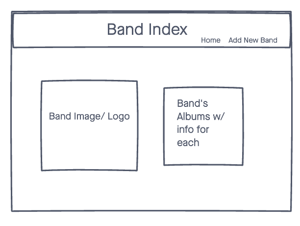

# Find-a-Band

# IMPORTANT!
In order to run this code make sure to run "npm i" to install all require node modules.

# Welcome to Find-a-Band!
This app allows users to search for any band they can think of! Can't find the band that you're looking for? You can add them in yourself!

## Technologies Used
- NodeJS
- Express
- MongoDB (database)
- HTML
- CSS
- JavaScript

## Features
- Allows users to find any band in the database.
- Allows users to click on a band name, and get detailed information about them. (albums, band members, etc.)
- Allows users to add any band that is not already stored in the database.
- If a band is already stored, users can still add any albums/ band members that are not already listed under that band 

# Wireframes
Home Page

Add Band

Band Index
